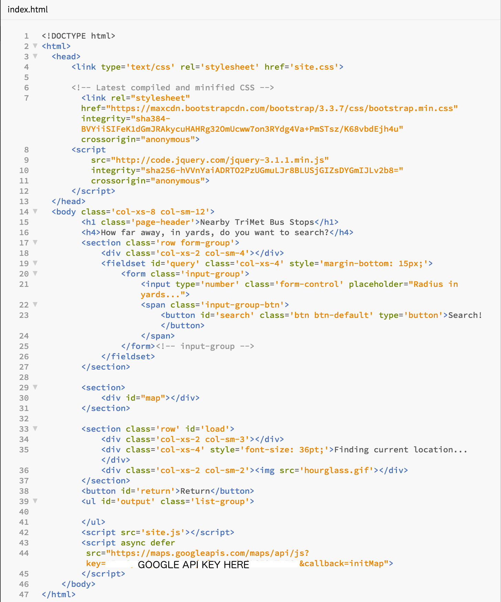
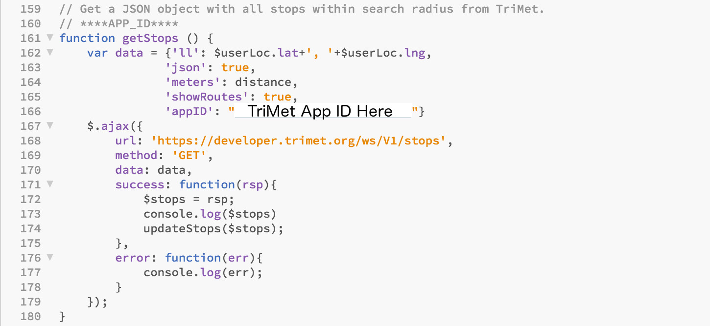
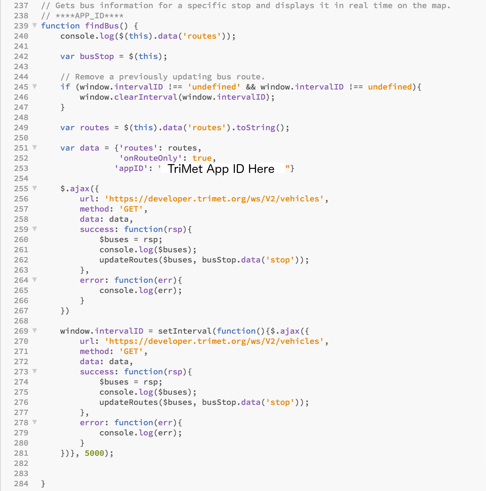

# PDX Bus Stop Finder

Built in JavaScript and JQuery, this app links into the native browser geolocation service to get
the user's current location. That is then fed into the Google Maps JavaScript API and the TriMet API to find nearby bus stops.

Users are able to select close by bus stops and see what buses service them, as well as where those buses are currently on their route. A feature, currently in beta, also allows users to see how long it will be until a bus arrives at the stop using the Google Distance Matrix Service API, which compares the latitude and longitude of the bus stop with the last reported latitude and longitude of the bus in question.

## Requirements:

At this point to use the service, you will have to get your own Google Maps API Key, as well as TriMet AppID and plug them into the application.

The Google Maps API Key goes in the bottom of the index.html document as seen below:

There are two sections that need to be edited in the site.js file to add your TriMet AppID. The first is in the getStops() function (below):

The second is in the findBus() function (below):

---

This is a work in progress. Many features still need to be corrected and I am sure there are many UX and general performance enhancements that can be done.

###### Future:
* Correct estimations for buses so that only buses going towards the stop show up and display the correct time.
 * Currently displaying the live bus locations shows all buses associated with the route, instead of just those servicing that stop.
* Pritify it more!
* Reduce the wait time on finding the user's location.
* Increase the accuracy of the user's location.
